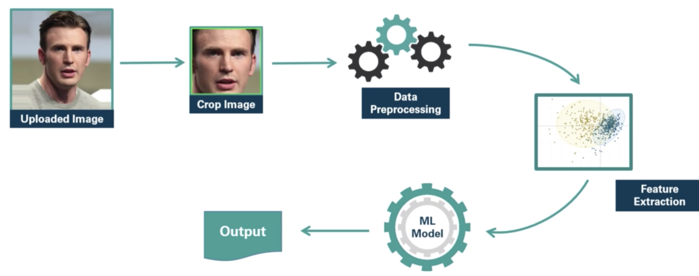
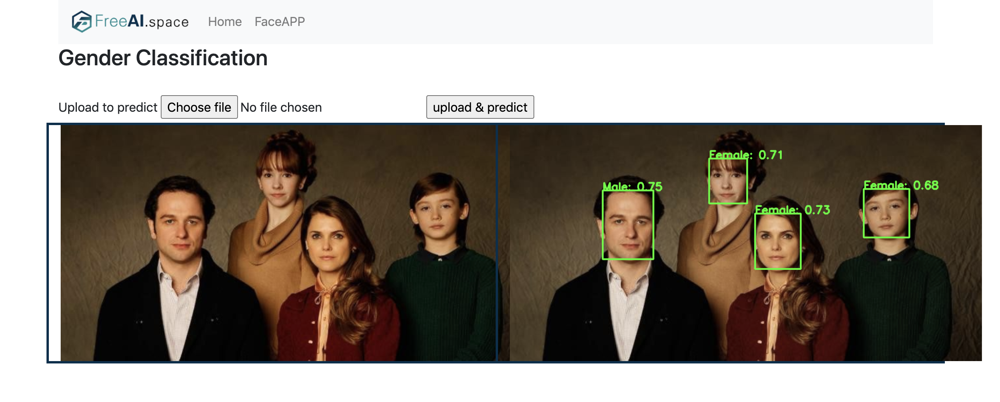
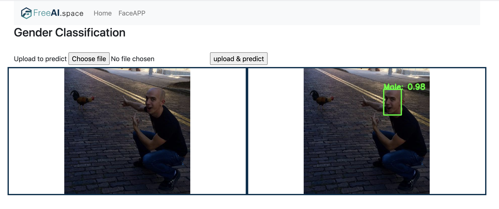

# gender-classification website
This project is just used to practice integrating flask technique and ML model and for fun, classification accuracy for non-frontal face cannot be guaranteed.
## Dependency
- python
- flask
- javascript
- html/css
## link 
Google Cloud based(faster)
https://angular-radar-283711.ts.r.appspot.com/

Ali Cloud based
http://8.210.3.198/
### pipeline
---

---
ssd for detection

pca and svm for classification

### some results
---

---

---

